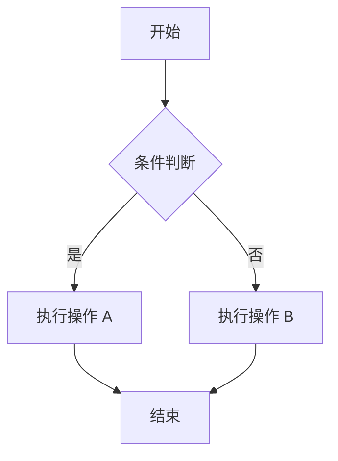
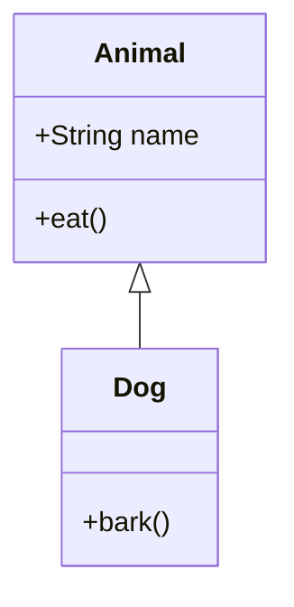

# Mermaid 工具使用指南

## 功能概述

`set_mermaid` 工具允许 AI 在页面右侧显示一个 Mermaid 图表面板，用户可以与图表进行交互。

## 功能特点

1. **动画效果**：面板展开和收起时使用平滑的动画过渡（基于 CSS transition）
2. **节点选择**：用户可以点击图表中的节点（支持选择 0 个或多个节点）
3. **节点提示**：选中节点后，在输入框上方显示选中的节点数量
4. **全屏模式**：支持全屏查看图表
5. **错误处理**：当 Mermaid 代码无效时显示错误信息

## AI 使用示例

AI 可以通过调用 `set_mermaid` 工具来显示图表：

```json
{
  "name": "set_mermaid",
  "arguments": {
    "code": "flowchart TD\n    A[开始] --> B{是否完成？}\n    B -->|是 | C[结束]\n    B -->|否 | D[继续工作]\n    D --> B"
  }
}
```

## 支持的 Mermaid 图表类型

- flowchart（流程图）
- sequenceDiagram（序列图）
- classDiagram（类图）
- stateDiagram（状态图）
- erDiagram（ER 图）
- pie（饼图）
- 等等...

## 用户交互

1. **查看图表**：AI 调用工具后，面板自动从右侧滑出
2. **选择节点**：点击图表中的任意节点进行选择/取消选择
3. **多选**：可以继续点击其他节点进行多选
4. **清空选择**：点击"清除选择"按钮或点击图表背景
5. **全屏查看**：点击全屏按钮放大查看
6. **关闭面板**：点击关闭按钮收起面板

## 技术实现

- **Mermaid.js**：用于渲染图表
- **CSS Transition**：实现平滑的动画效果
- **React 状态管理**：管理面板状态和节点选择
- **工具调用集成**：与 LangChain 工具系统集成

## 示例 Mermaid 代码

### 流程图



### 序列图

```mermaid
sequenceDiagram
    participant 用户
    participant 系统
    participant 数据库
    
    用户->>系统：请求数据
    系统->>数据库：查询
    数据库-->>系统：返回结果
    系统-->>用户：显示数据
```

### 类图



## 注意事项

1. 确保 Mermaid 代码语法正确
2. 复杂的图表可能需要更多渲染时间
3. 节点选择功能依赖于 Mermaid 生成的 SVG 结构
4. 某些特殊字符可能需要转义
